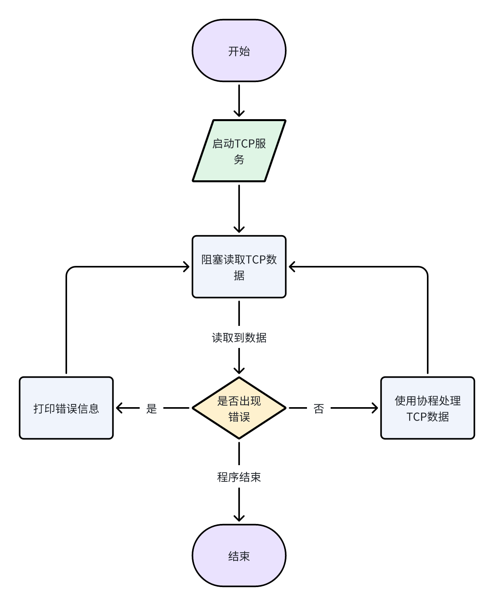

# 项目记录

| 名词   | 解释    |
|------|-------|
| root | 项目根目录 |

## 1.项目入口

> main.go (root)

```go
// Package main 程序主入口
package main

func main() {
	server := Server{ip: "127.0.0.1", port: 8080}
	server.Start()
}

```

## 2.Server类

> server.go (root)

主要的职责为使用TCP协议监听指定的网络地址

| 属性   | 描述        |
|------|-----------|
| ip   | 所要监听的网络IP |
| port | 所要监听的端口   |

| 方法        | 作用                                   |
|-----------|--------------------------------------|
| NewServer | Server对象的构造器，用于构造Server对象            |
| Start     | Server对象开始监听指定的网络地址                  |
| Handler   | Server对象接受到TCP数据后的处理方法，放入goroutine执行 |

监听处理数据的流程

